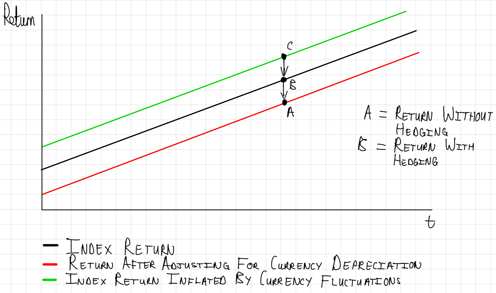

# Financial Econometrics 871 Practical Test Repository

This repository contains the materials for the Financial Econometrics 871 practical test, including datasets, utility scripts for analysis, and documentation templates for questions and presentations.

##  Note on question documentation:

Documentation for questions will follow this general format:
- Questions guiding analysis
- Code
  - Data Operations
  - Plotting Code
  - Any additional code
- Pitfalls and problems faced throughout analysis

---

## Table of Contents
1. [Installation](#installation)
2. [Project Organization](#project-organization)
3. [Question 1](#question-1)
4. [Question 2](#question-2)
5. [Question 3](#question-3)
6. [Question 4](#question-4)
7. [Question 5](#question-5)
8. [Question 6](#question-6)
9. [Utilities Functions](#utilities-functions)
10. [Documentation](#documentation)
11. [Authors](#authors)


---
##  Installation

The project makes use of the following packages, which can be loaded (save for `rugarch` & `rmgarch `with the external script `libraries.R` (see UTILITIES below):

- `dplyr`
- `ggplot2`
- `tidyverse`
- `tidyr`
- `stringr`
- `tidytext`
- `glue`
- `readxl`
- `xtable`
- `PerformanceAnalytics`
- `RcppRoll`
- `tbl2xts`
- `lubridate`
- `gt`
- `rmsfuns`
- `RiskPortfolios`
- `fitHeavyTail`
- `rportfolios`
- `ggExtra`
- `reshape2`
- `GGally`
- `rmgarch`
- `rugarch`

These libraries are loaded using the pacman package, which offers a more convenient way to load R packages, installing them if necessary. Ensure that pacman is installed on your machine by running the following code in R:

```r
if (!requireNamespace("pacman", quietly = TRUE)) {
  install.packages("pacman")
}

```

---

## Introductory Code

Each question starts with a setup chunk similar to this sample code below from Question 3:

```r
knitr::opts_chunk$set(echo = FALSE, message = FALSE, warning = FALSE, fig.width = 6, fig.height = 5, fig.pos="H", fig.pos = 'H')

    #   Housekeeping
rm(list = ls())
options(scipen = 999)
path <- "/Users/janhendrikpretorius/Library/CloudStorage/OneDrive-StellenboschUniversity/01-Masters-2023/02 Financial Econometrics/20713479-FMX-Prac/"

    #   Get external scripts
source(paste0(path, "UTILITIES/libraries.R")) #   Load libraries
source(paste0(path, "UTILITIES/aesthetics.R")) #  Get plot themes
source(paste0(path, "UTILITIES/missing-values.R")) #  Get imputing function
source(paste0(path, "UTILITIES/capping.R")) #  Capping functions


    #   Load Data
file <- "ALSI.rds"
ALSI <- read_rds(paste0(path, "DATA/", file))

file <- "Rebalance_days.rds"
RebDays <- read_rds(paste0(path, "DATA/", file))

file <- "Monthly_zar.rds"
ZAR <- read_rds(paste0(path, "DATA/", file))

```
---

## Project Organization

### `UTILITIES`:
This folder houses external scripts that enhance functionality.
  - `aesthetics.R`: Provides a standardised plotting theme.
  - `calc-portfolio-ret.R`: Function that calculates portfolio returns by reweighting
  - `capping.R`: Provides the `Proportional_Cap_Foo` function
  - `fee_converter.R`: Adjusts stock returns for a given annual fee by converting it into a monthly compounded fee and subtracting it from the returns.
  - `libraries.R`: Loads all necessary libraries and packages for the project via pacman.
  - `missing-values.R`: Provides the `impute_missing_returns` function.
  - `optim-foo-adj.R`: Uses quadratic programming to find the optimal weights for a portfolio based on expected returns, covariance, and constraints, returning the results as a table.
  - `optimise.R`:Optimizes portfolio weights based on input parameters such as expected returns and constraints. It handles errors and returns optimal weights for assets, considering various optimization types.
  - `renaming-ddc.R`: rename the columns of a time-varying correlation matrix for financial data analysis and prepare the data for visualization by transforming it into a tidy format.
  - `roll-optimiser.R`: Optimizes portfolio weights using a rolling window approach, calculating optimal weights based on historical data and constraints. It returns the optimal weights for each rolling period.

### `WRITE-UPS`:
Stores all write-ups and documentation for questions.
  - `Basic-Question-Template`: A folder housing the template for basic questions.
  - `Presentation-Question-Template`: A folder housing template for presentations.
  - `Question-#`: Write-up and code for Questions

### `MISC`:
Miscellaneous files such us the schematic shown in Question 2.
  
### `LICENSE`:
This project is licensed under the MIT License, which is a highly permissive and flexible open-source license.

---

##  Question 1

This question is stored in `WRITE-UPS`->`Question-1`. The presentation was drawn up using rmarkdown and beamer, in the file `Question-1-Presentation.Rmd`; while the knitted presentation is the file `Question-1-Presentation.pdf`. All code used to create the plots, and wrangle the data has been stored in the `code` folder, but also shown below.

The following section explains step by step how the problem in question 1 was approached. This section also contains code chunks used in the creation of the write-up document.

### The folllowing questions guide the analysis:

1. **Static Analysis:** How does the AI Implementer fund's performance compare with the Capped SWIX benchmark and ASISA active managers over the entire period?
2. **Fees and Performance:** Does the AI Implementer fund consistently outperform the benchmark after accounting for fees?
3. **Rolling Returns Performance:** How significantly do management and performance fees impact the net returns of the AI Implementer fund compared to the benchmark and peers?
4. **Correlations:** What is the correlation between benchmark and the performance of the AI Implementer fund?

### Code Summary:

1. **Data Preparation:**
   - Filters and selects actively managed funds from the ASISA dataset.
   - Calculates average returns for active funds and adjusts them for fees.
   - Randomly samples four active funds and prepares AI and Benchmark datasets.
   - Merges all prepared datasets for analysis.

2. **Data Inspection:**
   - Conducts basic data inspection and generates statistics for analysis.

3. **Boxplot Visualization:**
   - Creates a boxplot to compare fund returns, highlighting the median of the AI Implementer fund.

4. **Scatterplot Visualization:**
   - Constructs a scatterplot to compare fund returns against the benchmark, showing outperformance percentages.

5. **Cumulative Returns Visualization:**
   - Plots the growth of $1 invested over time for the selected funds.

6. **Rolling Returns Visualization:**
   - Displays 3-year rolling annual returns for the chosen funds.

#### Data operations:

- Uncertain whether all of the funds in ASISA are actively managed. My line of thinking is that if the fund is not an index (`Index` == "No"), it is actively managed. None of the funds are fund of funds (FoF), so this column is unneeded. Here I filter for actively managed funds and drop the Index and FoF columns (for cleaner data structure).
- Comparing all of the ASISA funds might be too broad. I then opted to randomly select 4 funds, as well as the average returns, to compare with the benchmark and AI fund.
- I then also adjusted returns based on fees, using the `fee-converter` function I created, that adjusts returns based on annual fees; which I specified as 100bps
- I prefer working with aggregate data sets (easier for plotting and analysis). The main merged data frames have the prefix Rets_ ("Returns").
  -  `Rets_long`: long format of merged data
  -  `Rets_wide`: wide format of merged data
  -  `Rets_long_cum`: filtered version of Rets_long that only starts with date >= 2014-02-28 (the date from which all funds have full data availability); contains cumulative returns for each fund and benchmark.
  -  `Rets_rolling`: contains 3-year rolling returns for funds 
- I later realised that I wanted to produce a scatter plot, which required additional data operations and allows me to compare the actively managed and AI funds with the benchmark. This new data set was saved as `Funds_all` (that is, all the AI and actively managed funds, compared to the Benchmark)
  -  The reason this was done: I needed both an x- and y-variable (and not the benchmark, AI, and actively managed funds in one variable (column)
  -  I then created `Funds_all` where the Benchmark can be used as an x-variable and AI and Actively Managed funds can be used as y-variables

```r

set.seed(123321)
sample_size = 4

# Filter ASISA for actively managed funds
ASISA_filtered <- ASISA %>%
  filter(Index == "No") %>%
  select(-Index, -FoF)

# Get average returns for active funds
ASISA_mean <- ASISA_filtered %>%
  group_by(date) %>%
  summarise(Returns = mean(Returns, na.rm = TRUE)) %>% 
  mutate(Fund = "Active Avg") %>%
  mutate(Returns = fee_converter(Returns, 0.01))

# Sample 4 random active funds from ASISA
ASISA_prepared <- ASISA_filtered %>%
  distinct(Fund) %>%
  sample_n(sample_size) %>%
  inner_join(ASISA_filtered, by = "Fund") %>%
  mutate(Returns = fee_converter(Returns, 0.01))

# Preparing AI dataframe
AI_prepared <- AI %>%
  rename(Returns = AI_Fund) %>%
  mutate(Fund = "AI Implementer")

# Preparing BM dataframe
BM_prepared <- BM %>%
  select(-Tickers) %>%
  mutate(Fund = "Benchmark")

# Merging all dataframes
Rets_long <- bind_rows(AI_prepared, BM_prepared, ASISA_prepared, ASISA_mean)


# Converting to wide format
Rets_wide <- Rets_long %>%
  spread(key = Fund, value = Returns)

#   Calculate cumulative returns
Rets_long_cum <- Rets_long %>%
  filter(date >= as.Date("2014-02-28")) %>%
  group_by(Fund) %>%
  mutate(Cumulative_Returns = cumprod(1 + Returns)) %>%
  ungroup()

#   Calculate 3 year rolling returns
Rets_rolling <- 
Rets_long %>% group_by(Fund) %>% 
# Epic sorcery:
mutate(RollRets = RcppRoll::roll_prod(1 + Returns, 36, fill = NA, 
    align = "right")^(12/36) - 1) %>% 
group_by(date) %>% filter(any(!is.na(RollRets))) %>% 
ungroup()

#   Comparing Funds against the Benchmark

# Prepare BM_all
BM_all <- BM_prepared %>%
  select(-Fund) %>%
  rename(Benchmark = Returns)

# Prepare ASISA_all
ASISA_all <- ASISA_prepared %>%
  mutate(Fund = "Actively Managed")

# Merge dataframes
merge_AI <- left_join(AI_prepared, BM_all, by = 'date')
merge_ASISA <- left_join(ASISA_all, BM_all, by = 'date')

Funds_all <- bind_rows(merge_AI, merge_ASISA)

```


#### Data Inspection:

```r

# Basic data inspection
tablestats <-
  Rets_wide %>% tbl_xts() %>% 
  table.Stats(., ci = 0.95, digits = 3)
print(tablestats[,1:7])

```

#### Plotting:

```r

# Calculate the median for the AI fund
ai_median <- median(Rets_wide$`AI Implementer`, na.rm = TRUE)

boxplot <- Rets_long %>% 
    ggplot(aes(x = Fund, y = Returns, fill = Fund)) +
      geom_boxplot(color = "black") +
      geom_hline(yintercept = ai_median, linetype = "dashed", color = "black", size = 1) +
      scale_fill_manual(values = palette) +
      labs(title = "Comparison of Returns* Across Funds",
           subtitle = "Horizontal dashed line represents median of AI Implementer returns,\nwhich is 0.02.",
           caption = "*After fees (Management fee is 100bps)",
           x = "Fund",
           y = "Returns",
           fill = "Fund") +
      th +
      theme(legend.position = "none",
            axis.text.x = element_text(angle=90, hjust = 1))
ggsave("Figures/boxplot.png", plot = boxplot)

```


```r

calculate_performance <- function(data, fund_name) {
    # Calculate the number of instances of outperformance
    outperform <- data %>%
        filter(Fund == fund_name & Returns > Benchmark) %>%
        nrow()

    # Calculate the number of instances of underperformance
    underperform <- data %>%
        filter(Fund == fund_name & Returns < Benchmark) %>%
        nrow()

    # Calculate the percentage of outperformance
    perform_percentage <- outperform / (outperform + underperform) * 100

    # Return the formatted percentage as a string
    rounded_performance <- round(perform_percentage, 2)
    return(paste0(rounded_performance, "%"))
}


performance_active <- calculate_performance(Funds_all, "Actively Managed")
performance_ai <- calculate_performance(Funds_all, "AI Implementer")

# Create the scatter plot
scatplot <- Funds_all %>% 
    ggplot(aes(x = Benchmark, y = Returns, color = Fund)) +
        # Shading triangles
        geom_ribbon(aes(ymin = -Inf, ymax = Benchmark), fill = "#C93D44", alpha = 0.2) +
        geom_ribbon(aes(ymin = Benchmark, ymax = Inf), fill = "#75A21B", alpha = 0.2) +
        geom_point(size = 1) +  # Add points
        geom_abline(slope = 1, intercept = 0, linetype = "dashed") +  # 45-degree line
        geom_smooth(method = "lm", formula = y ~ x, aes(group = Fund), se = FALSE) +  # Ab-lines
        scale_color_manual(values = palette) +
        labs(title = "Comparison of Fund Returns* vs. Benchmark",
             subtitle = "Dashed line represents a 45º-line, indicating a 1-to-1 correlation between\nfund returns and benchmark. Actively managed funds outperform the\nbenchmark 44.57% of the time, while AI Implementer outperforms\n57.43% of the time.",
             caption = "*After fees (Management fee is 100bps)",
             x = "Benchmark Returns",
             y = "Fund Returns",
             color = "Fund Type") + th +
    annotate("text", x = -0.08, y = 0.15, label = "Outperform Benchmark", hjust = 0.5, family= "Palatino") +
    annotate("text", x = 0.08, y = -0.15, label = "Underperform Benchmark", hjust = 0.5, family= "Palatino")


# Add labels to the plot
scatplot <- scatplot 

# Here, x_position, y_position_1, and y_position_2 are the coordinates where you want to place the labels.
# You need to adjust these based on your plot's scale and layout.

# Now, you can view or save your plot
print(scatplot)

ggsave("Figures/scatplot.png", plot = scatplot)

```


```r
cumplot <- Rets_long_cum %>% 
    #filter(Fund == "Active Avg" | Fund == "AI Implementer" | Fund == "Benchmark") %>% 
    ggplot(aes(x = date, y = Cumulative_Returns, color = Fund)) +
      geom_line(size = 1) +
      scale_color_manual(values = palette) +
      labs(title = "Growth of $1 Invested* Over Time",
           caption = "*After fees (Management fee is 100bps)",
           x = "Date",
           y = "Cumulative Returns",
           color = "Fund") +
      scale_y_continuous(labels = scales::dollar_format(prefix = "$", suffix = "")) +
      th

ggsave("Figures/cumplot.png", plot = cumplot)

```

```r
rollplot <- Rets_rolling %>% 
    #filter(Fund == "Active Avg" | Fund == "AI Implementer" | Fund == "Benchmark") %>% 
    ggplot(aes(x = date, y = RollRets, color = Fund)) +
      geom_line(size = 0.8) +
      scale_color_manual(values = palette) +
      labs(title = "3-Year Rolling Annual Returns* for Selected Funds",
           caption = "*After fees (Management fee is 100bps)",
           x = "",
           y = "Rolling 3 year Returns (Ann.)",
           color = "Fund") +
      scale_y_continuous(labels = scales::percent_format(scale = 100)) +
      th

ggsave("Figures/rollplot.png", plot = rollplot)

```

### Some pitfalls along the way:

- Comparing the plethora of ASISA funds with the benchmark and AI fund proved too wide. I had to narrow down the funds to compare. I first tried average returns, but this means that we lose a lot of the particular nuance in many of the funds. I then opted to compare quartiles, but in doing so, you bias the comparison by comparing low performing, average performing, and high performing funds by "selecting them". You also lose very important risk metrics. The final call was to randomly select 4 funds to compare as well as the average returns of the active funds.
- Many of the actively managed funds have data only starting from much later. For the cumulative returns analysis, I had to filter the data from specific periods (in this case from 2014-02-28) in order to accurately compare cumulative returns.
- I decided calculating rolling returns was the best option to meaningfully compare the funds with each other.

---

##  Question 2

This question is stored in `WRITE-UPS`->`Question-2`. The following section explains step by step how the problem in question 2 was approached. This section also contains code chunks used in the creation of the write-up document.

### The folllowing questions guide the analysis:

1. **How do Hedged and Unhedged Portfolios Compare in Terms of Cumulative Returns?**
   - This question aims to understand the overall performance of hedged versus unhedged portfolios over time. The cumulative returns plot helps in visualizing which strategy outperforms the other over the study period.

2. **What is the Impact of Currency Hedging on Rolling Returns?**
   - By examining 3-year rolling returns, the analysis seeks to determine how currency hedging influences the stability and consistency of returns over different market conditions.

3. **How Does Currency Movement Affect Portfolio Returns in USD Terms?**
   - This aspect of the analysis focuses on the relationship between USD-ZAR currency movements and the performance of portfolios when converted to USD. It aims to understand the risk and return dynamics from a currency perspective.

4. **What is the Downside Risk Associated with Hedged and Unhedged Portfolios?**
   - The analysis here is geared towards understanding the risks involved in both strategies, especially focusing on the downside risks and how they differ between the hedged and unhedged portfolios.

5. **How do Hedged and Unhedged Portfolios Compare in Terms of Rolling Volatility?**
   - This question delves into the volatility aspect of the portfolios. It examines whether hedging reduces the variability of returns over time and how significant this reduction is.

6. **What are the Distributions of Rolling Volatility for Hedged and Unhedged Portfolios?**
   - By creating histograms and violin plots, the analysis aims to explore the distribution and range of volatilities for both portfolio structures, giving insights into their risk profiles.


### Approach:

Let us first work on an approach to simulate currency hedging. Here is my line of thinking to do so:

I attempt to simulate the effect of currency hedging on an investment portfolio by adjusting the returns of South African indices (J433, ALBI) and US$ denominated indices in response to the ZAR/USD exchange rate fluctuations. The methodology involves recalculating the returns of these local indices by inflating/deflating them with exchange rate growth, derived from the ZAR/USD exchange rate data. This adjustment aims to nullify the impact of currency movements, mimicking a hedging strategy that protects against exchange rate risks. The performance of this 'fully hedged' portfolio is then compared with an 'unhedged' portfolio (without such adjustments) to evaluate the effectiveness of the simulated currency hedging strategy in stabilizing portfolio returns against foreign exchange volatility. **Note:** Both the 'hedged' and 'unhedged' portfolios were rebalanced every quarter.

For more clarification, consider the simplified schematic below:


To replicate the study and compare a hedged and unhedged portfolio, we'll need to follow these steps:

1.  Create the Portfolio Composition:

- The portfolio is a 60/40 Equity/Bond split with a 70/30 Local/Global split.
- In the Indexes dataframe, we have MSCI_ACWI and Bbg_Agg for global equity and bond indices, and J433 and ALBI for local equity and bond indices.

2.  Calculate Portfolio Returns:

- Combine returns according to the specified portfolio weights.

3. Hedging and Unhedging:

- For the unhedged portfolio, we'll use the returns as they are.
- For the hedged portfolio, we'll need to adjust the returns of the indices using the exchange rate data in ZAR. This simulates the effect of hedging against currency fluctuations.

4.  Compare the Portfolios:

- Calculate the rolling realized volatility for both portfolios.
- Compare these volatilities over time to analyze the impact of hedging.
- Calculate return metrics.

### Code Summary:

1. **Data Loading**: Imported data from `Cncy_Hedge_Assets.rds` and `Monthly_zar.rds`, standardizing date formats for consistency.

2. **Currency Conversion**: Adjusted portfolio returns based on USD-ZAR exchange rates to analyze both hedged and unhedged portfolios in USD terms.

3. **Portfolio Returns Calculation**: Used custom functions to calculate returns for both portfolio types across different rebalancing periods.

4. **Performance Analysis**: Computed and plotted cumulative and rolling returns to compare portfolio performance over time.

5. **Exchange Rate Impact Assessment**: Analyzed the relationship between USD-ZAR exchange rate movements and USD portfolio returns.

6. **Risk Metrics Calculation**: Evaluated downside risks of both portfolio types to understand their risk profiles.

7. **Volatility Analysis**: Calculated and visualized rolling volatility, comparing volatility distributions of hedged and unhedged portfolios.

#### Data operations:

```r

RebMonths <- c(3, 6, 9, 12) # Rebalancing periods

# Convert the date format to Year-Month for both dataframes
Indexes <- Indexes %>% 
  mutate(date = floor_date(as.Date(date), "month"))

ZAR <- ZAR %>% 
  mutate(date = floor_date(as.Date(date), "month"))

# Note on calculatePortfolioReturns():
    # Need a wide format dataframe with a date column and returns only!
    # It is a very situational specific function and not very general

# Calculate returns of unhedged portfolio
Unhedged_portf <- calculatePortfolioReturns(Indexes, RebMonths) %>% 
    mutate(Structure = "Unhedged")

# Calculate returns of hedged portfolio

# Align dates and compute growth rate of ZAR to USD exchange rate
ZAR <- ZAR %>% mutate(ExchangeRateGrowth = (value / lag(value)) - 1)

# Adjust returns in Indexes by exchange rate appreciation/depreciation
Indexes_adjusted <- Indexes %>%
  mutate(date = as.Date(date)) %>%
  left_join(ZAR %>% select(date, ExchangeRateGrowth), by = "date") %>%
  mutate_at(vars(J433, ALBI), ~ . * (1 + ExchangeRateGrowth)) %>% # Inflate Rand-denominated indexes
  mutate_at(vars(MSCI_ACWI, Bbg_Agg), ~ . / (1 + ExchangeRateGrowth)) %>% # Deflate Dollar-denominated indexes
  select(-c(ExchangeRateGrowth))

Hedged_portf <- calculatePortfolioReturns(Indexes_adjusted, RebMonths) %>% 
    mutate(Structure = "Hedged")

# Merge the unhedged and hedged portfolio returns
combined_portfolio <- bind_rows(Unhedged_portf, Hedged_portf)

# Calculate cumulative and rolling returns
combined_portfolio <- combined_portfolio %>%
  group_by(Structure) %>%
  arrange(date) %>%
  mutate(CumulativeReturn = cumprod(1 + PortfolioReturn)) %>%
  mutate(RollRets = RcppRoll::roll_prod(1 + PortfolioReturn, 36, fill = NA, 
  align = "right")^(12/36) - 1) %>% 
  group_by(date) %>% filter(any(!is.na(RollRets))) %>% 
  ungroup()

```

#### Plotting:

```r

# Plot the cumulative returns
combined_portfolio %>% 
ggplot(aes(x = date, y = CumulativeReturn, color = Structure)) +
  geom_line() +
  th +
  labs(title = "Cumulative Portfolio Returns: Hedged vs Unhedged",
       x = "Date",
       y = "Cumulative Return",
       color = "Structure") +
  scale_color_manual(values = palette)

```


```r

# Plot the rolling returns
combined_portfolio %>% 
ggplot(aes(x = date, y = RollRets, color = Structure)) +
  geom_line() +
  th +
  labs(title = "3-Year Rolling Returns: Hedged vs Unhedged",
       x = "Date",
       y = "Rolling 3 year Returns (Ann.)",
       color = "Structure") +
  scale_color_manual(values = palette)

```

```r

# Convert returns to USD-returns
Indexes_USD <- Indexes %>%
  mutate(date = as.Date(date)) %>%
  left_join(ZAR %>% select(date, ExchangeRateGrowth), by = "date") %>%
  mutate_at(vars(J433, ALBI), ~ . / (1 + ExchangeRateGrowth)) %>% 
  select(-c(ExchangeRateGrowth))

USD_portf <- calculatePortfolioReturns(Indexes_adjusted, RebMonths) %>% 
    mutate(Hedged = "Yes")

scatter_data <- USD_portf %>%
  left_join(ZAR %>% select(date, ExchangeRateGrowth), by = "date") %>%
  rename(USD_ZAR_Returns = ExchangeRateGrowth,
         Portfolio_Returns_USD = PortfolioReturn) %>%
  select(date, USD_ZAR_Returns, Portfolio_Returns_USD)

# Create the scatter plot
p <- scatter_data %>% 
        ggplot(aes(x = USD_ZAR_Returns, y = Portfolio_Returns_USD)) +
            geom_point(color = "#D98515", alpha=0.6) +
            geom_smooth(method = "lm", color = "darkgrey", se=FALSE) +
            scale_x_continuous(labels = scales::percent_format(scale = 100), limits = c(-0.15, 0.15)) +
            scale_y_continuous(labels = scales::percent_format(scale = 100), limits = c(-0.15, 0.15)) +
            geom_hline(yintercept = 0, linetype = "dashed", color = "darkgrey") +
            geom_vline(xintercept = 0, linetype = "dashed", color = "darkgrey") +
            th +
            labs(x = "USD-ZAR Returns", 
                 y = "Portfolio Returns (USD)", 
                 title = "Scatter Plot with Marginal Distributions",
                 caption = "Calculations from 28 February 2002 - 31 August 2023")

# Add marginal histograms
p <- ggExtra::ggMarginal(p, type = "density", fill = "#1E3364", alpha = 0.6)

print(p)
```


# Next create the downside risk table from Prac 2

```r

# Separate hedged and unhedged data
df_hedged <- combined_portfolio %>% filter(Structure == "Hedged") %>% select(date, PortfolioReturn)
df_unhedged <- combined_portfolio %>% filter(Structure == "Unhedged") %>% select(date, PortfolioReturn)

# Rename columns to match the example structure
df_hedged <- df_hedged %>% rename(Hedged = PortfolioReturn)
df_unhedged <- df_unhedged %>% rename(Unhedged = PortfolioReturn)

# Calculate Downside Risk
tabdownside <- table.DownsideRisk(left_join(df_unhedged, df_hedged, by = "date") %>% tbl_xts(.), 
                                  ci = 0.95, Rf = 0, MAR = 0)

# Select specific rows
tabdownside <- tabdownside[c(1,5,7,8:11),]

# Format and display the table
tabdownside %>% 
  data.frame() %>% 
  tibble::rownames_to_column() %>% 
  gt() %>% 
  tab_header(title = glue("Downside Risk Estimates")) %>% 
  fmt_percent(columns = 2:3, decimals = 2)


```

```r

# Calculate 30-day rolling volatility
combined_portfolio <- combined_portfolio %>%
    group_by(Structure) %>%
    arrange(date, .by_group = TRUE) %>%
    mutate(RollingVolatility = rollapply(PortfolioReturn, width = 36, FUN = sd, na.rm = TRUE, fill = NA, align = "right"))

# Plotting
ggplot(combined_portfolio, aes(x = date, y = RollingVolatility, color = Structure)) +
    geom_line() +
    scale_color_manual(values = palette) +
    labs(title = "36-month Rolling Volatility",
         x = "Date",
         y = "Volatility (Standard Deviation)",
         color = "Structure") +
    th


```

```r

volatility_data <- combined_portfolio %>%
  filter(!is.na(RollingVolatility))

# Create a histogram of the rolling volatility
ggplot(volatility_data, aes(x = RollingVolatility, fill = Structure)) +
  geom_histogram(position = "identity", alpha = 0.6, bins = 30, colour = "black", size = 0.3) +
  labs(title = "Histogram of 36-Month Rolling Volatility",
       x = "Rolling Volatility (Standard Deviation)",
       y = "Frequency") +
  scale_fill_manual(values = palette) +
  th

```


```r

# Create a box plot of the rolling volatility
ggplot(volatility_data, aes(x = Structure, y = RollingVolatility, fill = Structure, color = Structure)) +
  geom_violin(alpha = 0.6) +
  geom_jitter() +
  labs(title = "Violin Plot of 36-Month Rolling Volatility",
       x = "Portfolio Structure",
       y = "Rolling Volatility (Standard Deviation)") +
  scale_fill_manual(values = palette) +
  scale_color_manual(values = palette) +
  th

```


### Some pitfalls along the way:

- Because of the weighting of the portfolio, we would need to readjust the weights periodically.
- The last day of the month for ZAR does not align with Indexes. However, I opted to calculate the month on month exchange rate appreciation/depreciation and then overlapped that with the dates for Indexes

---

##  Question 3

This question is stored in `WRITE-UPS`->`Question-3`. The following section explains step by step how the problem in question 3 was approached. This section also contains code chunks used in the creation of the write-up document.

### The folllowing questions guide the analysis:

1. **Size and Sector Impact on ALSI and SWIX Performance**: How do size categories (large, mid, small caps) and sector distributions influence the performance of the ALSI and SWIX indexes over time?

2. **Rebalancing Effects and Market Dynamics**: What is the impact of rebalancing days on the ALSI and SWIX indexes? Are there correlations with market volatility and currency performance?

3. **Capping Levels and Index Performance**: What are the effects of different capping levels on the diversification and performance of the ALSI and SWIX indexes?

### Code Summary:

1. **Data Handling:**
   - We load ALSI, rebalance days (RebDays), and ZAR exchange rate (ZAR) data.
   - Data is cleaned, and weighted returns are calculated for ALSI with J203 and J403.

2. **Analysis and Visualization:**
   - Monthly returns are calculated for ALSI and adjusted for currency (ZAR) fluctuations.
   - Rolling returns, cumulative returns, and sector exposures are visualized.
   - Correlation analysis between ALSI returns and ZAR exchange rates is performed.

3. **Capping Analysis (Unfinished):**
   - The code prepares data for analyzing capping effects on ALSI indexes but is unfinished.

Key Dataframes:
- `ALSI`: ALSI index data.
- `RebDays`: Rebalance day information.
- `ZAR`: ZAR exchange rate data.
- `ALSI_J203` and `ALSI_J403`: Dataframes for ALSI indexes.

Feel free to use this shortened explanation in your readme section.

#### Data operations:
```r

# Define window size
window_size <- 252  # Approximately one trading year

ALSI <- ALSI %>% 
  mutate(Index_Name = ifelse(is.na(Index_Name), "Small_Caps", Index_Name))

# Replace NA in J403 for specific tickers
ALSI <- ALSI %>%
  mutate(J403 = case_when(
    Tickers == "HPB" & is.na(J403) ~ 0.000046,   # Replace NA for HPB
    Tickers == "ROC" & is.na(J403) ~ 0.0023,     # Replace NA for ROC
    TRUE ~ J403                                  # Keep other values as is
  ))

# Calculate weighted returns for ALSI and SWIX
ALSI <- ALSI %>% 
  mutate(WeightedReturn_J203 = Return * J203,
         WeightedReturn_J403 = Return * J403)


# Filter rows where Index_Name is NA and select unique tickers
tickers_with_na <- ALSI %>%
  filter(is.na(Index_Name)) %>%
  distinct(Tickers)

# Sum up weighted returns by size index and date for J203
ALSI_J203 <- ALSI %>% 
  group_by(date, Index_Name) %>% 
  summarize(WeightedReturn = sum(WeightedReturn_J203))

# Sum up weighted returns by size index and date for J403
ALSI_J403 <- ALSI %>% 
  group_by(date, Index_Name) %>% 
  summarize(WeightedReturn = sum(WeightedReturn_J403))

# Calculate cumulative and rolling returns for daily data
ALSI_J203 <- ALSI_J203 %>%
  group_by(Index_Name) %>%
  arrange(date) %>%
  mutate(CumulativeReturn = cumprod(1 + WeightedReturn)) %>%
  mutate(RollingReturn = roll_prod(1 + WeightedReturn, 252, fill = NA, 
                                    align = "right")^(252/252) - 1) %>%
  filter(!is.na(RollingReturn)) %>%
  ungroup() %>%
  group_by(Index_Name) %>%
  arrange(date, .by_group = TRUE) %>%
  mutate(RollingVolatility = rollapply(WeightedReturn, width = window_size, FUN = sd, na.rm = TRUE, fill = NA, align = "right")) %>%
  ungroup() %>%
    group_by(Index_Name) %>% 
    arrange(date) %>%
    mutate(MaxCumulativeReturn = cummax(CumulativeReturn),
           Drawdown = (-1) *(MaxCumulativeReturn - CumulativeReturn) / MaxCumulativeReturn) %>% 
  ungroup()

ALSI_J403 <- ALSI_J403 %>%
  group_by(Index_Name) %>%
  arrange(date) %>%
  mutate(CumulativeReturn = cumprod(1 + WeightedReturn)) %>%
  mutate(RollingReturn = roll_prod(1 + WeightedReturn, 252, fill = NA, 
                                    align = "right")^(252/252) - 1) %>%
  filter(!is.na(RollingReturn)) %>%
  ungroup() %>%
  group_by(Index_Name) %>%
  arrange(date, .by_group = TRUE) %>%
  mutate(RollingVolatility = rollapply(WeightedReturn, width = window_size, FUN = sd, na.rm = TRUE, fill = NA, align = "right")) %>%
  ungroup() %>%
    group_by(Index_Name) %>% 
    arrange(date) %>%
    mutate(MaxCumulativeReturn = cummax(CumulativeReturn),
           Drawdown = (-1) * (MaxCumulativeReturn - CumulativeReturn) / MaxCumulativeReturn) %>% 
  ungroup()

ALSI_J203_long <- ALSI_J203 %>%
  gather(key = "ReturnType", value = "Return", RollingReturn, CumulativeReturn, RollingVolatility, Drawdown)

ALSI_J403_long <- ALSI_J403 %>%
  gather(key = "ReturnType", value = "Return", RollingReturn, CumulativeReturn, RollingVolatility, Drawdown)

# Sector exposure

# Calculate sector weights for both J203 and J403
sector_weights <- ALSI %>%
  group_by(date, Sector) %>%
  summarize(SectorWeight_J203 = sum(J203),
            SectorWeight_J403 = sum(J403), .groups = 'drop') %>%
  ungroup() %>%
  pivot_longer(cols = c(SectorWeight_J203, SectorWeight_J403),
               names_to = "Index",
               values_to = "Weight")

# Renaming for clarity
sector_weights$Index <- gsub("SectorWeight_", "", sector_weights$Index)

```

```r

ALSI_monthly <- ALSI %>%
  group_by(date = floor_date(date, "month")) %>%
  # Calculate cumulative returns for J203 and J403
  mutate(CumulativeReturn_J203 = cumprod(1 + WeightedReturn_J203) - 1,
         CumulativeReturn_J403 = cumprod(1 + WeightedReturn_J403) - 1) %>%
  # Summarize and rename columns directly
  summarize(MonthlyReturn_J203 = last(CumulativeReturn_J203, na.rm = TRUE),
            MonthlyReturn_J403 = last(CumulativeReturn_J403, na.rm = TRUE),
            .groups = 'drop')
# Get ZAR ready
zar_growth_rate <- ZAR %>%
  arrange(date) %>%
  mutate(ZARGrowth = (value / lag(value) - 1)) %>% 
  select(-c(Tickers))  %>%
  mutate(date = floor_date(date, "month")) %>% 
  rename("ExchangeRate" = "value")

ALSI_monthly <- ALSI_monthly %>%
  left_join(zar_growth_rate, by = "date") %>%
  group_by(date) %>%
  arrange(date) %>%
  mutate(CumulativeReturn_J203 = cumprod(1 + MonthlyReturn_J203)) %>%
  mutate(CumulativeReturn_J403 = cumprod(1 + MonthlyReturn_J403))

ALSI_monthly_long <- ALSI_monthly %>%
  pivot_longer(cols = c(MonthlyReturn_J203, MonthlyReturn_J403, CumulativeReturn_J203, CumulativeReturn_J403, ExchangeRate, ZARGrowth),
               names_to = "ReturnType",
               values_to = "Return")
```
##### Capping (Unfinished Section)

```r
# Prepare the data:
# get rebalancing days
rebalance_days <- RebDays %>%
  filter(Date_Type == "Reb Trade Day") %>%
  pull(date)

ALSI_J203 <- ALSI %>% 
    select(-c(J403, WeightedReturn_J403))

ALSI_J403 <- ALSI %>% 
    select(-c(J203, WeightedReturn_J203))

# Step 1: Calculate daily total weight per sector
daily_sector_weight_J203 <- ALSI_J203 %>%
  group_by(date, Sector) %>%
  summarize(DailyTotalWeight = sum(J203, na.rm = TRUE), .groups = 'drop')

# Step 2: Calculate the average of daily totals over the entire period
average_sector_weight_J203 <- daily_sector_weight_J203 %>%
  group_by(Sector) %>%
  summarize(AverageWeight = mean(DailyTotalWeight, na.rm = TRUE), .groups = 'drop')

ALSI_J203_industry_returns <- ALSI_J203 %>%
  group_by(date, Sector) %>%
  summarize(TotalWeight = sum(J203, na.rm = TRUE),
            SumWeightedReturns = sum(WeightedReturn_J203, na.rm = TRUE),
            RealizedReturn = SumWeightedReturns / TotalWeight,
            AverageUnweightedReturn = mean(Return, na.rm = TRUE),
            .groups = 'drop')

sector_caps <- c("Financials" = 0.20, "Industrials" = 0.40, "Property" = 0.05, "Resources" = 0.35)

ALSI_J203_capped <- apply_industry_caps(ALSI_J203_industry_returns, sector_caps, rebalance_days)

# Calculate total daily rebalanced return for the index
total_daily_rebalanced_returns <- ALSI_J203_capped %>%
  group_by(date) %>%
  summarize(TotalRebalancedReturn = sum(AdjustedWeight * RealizedReturn, na.rm = TRUE),
            .groups = 'drop')

# Calculate cumulative returns
cumulative_returns <- total_daily_rebalanced_returns %>%
  mutate(BalancedCumulativeReturn = cumprod(1 + TotalRebalancedReturn))


# Calculate daily total weighted returns for J203
daily_total_weighted_returns_J203 <- ALSI %>%
  group_by(date) %>%
  summarize(DailyTotalWeightedReturn = sum(WeightedReturn_J203, na.rm = TRUE),
            .groups = 'drop')

# Calculate cumulative returns
cumulative_returns_J203 <- daily_total_weighted_returns_J203 %>%
  mutate(CumulativeReturn_J203 = cumprod(1 + DailyTotalWeightedReturn))

# Merge with cumulative_rebalanced_returns
cumulative_returns <- cumulative_returns %>%
  left_join(cumulative_returns_J203, by = "date")

```
#### Plotting:

```r
ALSI_J203_long %>% 
    ggplot(aes(x = date, y = Return, color = Index_Name)) +
      geom_line() +
      labs(title = "ALSI J203 Returns",
           caption = "Rolling returns calculated as one-year rolling returns (Ann.).",
           x = "Date", 
           y = "Returns") +
      th +
      scale_color_manual(values = palette) +
      facet_wrap(~ReturnType, scales = "free_y", ncol = 2)


```

```r

ALSI_J403_long %>% 
    ggplot(aes(x = date, y = Return, color = Index_Name)) +
      geom_line() +
      labs(title = "ALSI J403 Returns",
           caption = "Rolling returns calculated as one-year rolling returns (Ann.).",
           x = "Date", 
           y = "Returns") +
      th +
      scale_color_manual(values = palette) +
      facet_wrap(~ReturnType, scales = "free_y", ncol = 2)


```

```r

sector_weights %>% 
    ggplot(aes(x = date, y = Weight, fill = Sector)) +
      geom_bar(stat = "identity", position = "stack") +
      facet_wrap(~Index, scales = "free_x", ncol = 1) +
      labs(title = "Sector Weights Over Time for J203 and J403",
           x = "Date", y = "Weight") +
      th +
      scale_fill_manual(values = palette)

```

```r

# Correlation analysis

cor_J203 = cor(ALSI_monthly$MonthlyReturn_J203, ALSI_monthly$ExchangeRate)
cor_J403 = cor(ALSI_monthly$MonthlyReturn_J403, ALSI_monthly$ExchangeRate)

cor_J203 <- round(cor_J203, 2)
cor_J403 <- round(cor_J403, 2)

# Create a data frame for the gt table
cor_df = data.frame(
  Index = c("J203", "J403"),
  Correlation_with_ExchangeRate = c(cor_J203, cor_J403)
)

# Create a gt table
gt(cor_df) %>%
  tab_header(
    title = "Correlation with Exchange Rate"
  ) %>%
  cols_label(
    Index = "Index",
    Correlation_with_ExchangeRate = "Correlation with Exchange Rate"
  )

```


### Some pitfalls along the way:

- The first issue I encountered is missing values in the Index_Name column of ALSI. I first identified Tickers that resulted in these NA values. I initially replaced the NA values in the Index_Name column with "Unclassified" as a straightforward and transparent way to handle missing data in this context. This approach allows one to keep all the data points in the analysis while acknowledging that certain tickers couldn't be classified into the existing size categories (Large, Mid, Small Caps).
- However, after looking at their movement, which closely resembled small caps movement, I imputed these missing values as "Small Caps"
- Rolling returns and daily data: A common approach for daily data is to use a 252-day window, as there are typically 252 trading days in a year. This is the approach that was followed.
- More missing weight values for J403. I just replaced the NA values with 0,000046 and 0,0023 for HPB and ROC respectively, reflecting numbers close to the weights at the time.
- When I attempted to cap by industry, I ran into the problem of being unable to calculate the unweighted realized industry returns, because I needed the data on an industry-wide level. The capping process turned out much more complex then I could have imagined. I then decided to opt for the easiest (albeit not the best) route and got the average unweighted returns per industry in order to reweight based on the capping.
- In the end, I decided to abandon the project as I was consuming way too much time on this question and opted to use what I already had for the report. The unfinished code has, however, been included.

---

##  Question 4

This question is stored in `WRITE-UPS`->`Question-4`. The following section explains step by step how the problem in question 4 was approached. This section also contains code chunks used in the creation of the write-up document.

### The folllowing questions guide the analysis:

1. **Does Past Performance Affect Future Fund Flows?**
   - This question seeks to understand whether there is a persistent trend where funds that performed well in the past continue to attract more investment in subsequent periods.

2. **How Do Funds Categorized by Performance (Top, Middle, Bottom) Differ in Terms of Subsequent Flows?**
   - This involves analyzing whether top-performing funds (based on rolling returns) consistently receive higher investment flows compared to middle or bottom-tier funds.

3. **What is the Correlation Between Fund Returns and Future Fund Flows?**
   - This question aims to quantify the relationship between the returns of a fund and the investment flows it receives in future periods, exploring different time lags (1 month, 3 months, 1 year, etc.).

4. **What is the Impact of Fund Performance on Future Flows in Different Time Frames?**
   - This question seeks to understand how the timing of fund flows is affected by past performance, considering short-term (1 month), medium-term (1 year), and long-term (up to 5 years) periods.


### Code Summary:

1. **Data Merging and Cleaning**: The code begins by joining two datasets, `Rets` and `Flows`, on multiple keys and filters out Funds of Funds and index funds to focus on actively managed funds.

2. **Rolling Return Calculation**: It calculates 3-year rolling returns for each fund, providing an annualized metric of past performance.

3. **Performance Categorization**: Funds are categorized based on their rolling returns into Top, Middle, and Bottom performance groups.

4. **Future Flows Calculation**: The code generates lead variables to examine fund flows at different future time points—1 month, 6 months, 1 year, 2 years, and 3 years after the performance measurement.

5. **Correlation Analysis**: A custom function calculates the correlation between rolling returns and future flows at each time lag, quantifying the relationship between past performance and future investment behavior.

6. **Statistical Testing**: The `cor.test` function is employed to determine the statistical significance of the observed correlations.

7. **Data Visualization**: Several `ggplot2` visualizations are produced to illustrate the trends in rolling returns and fund flows over time, and the correlations between them.

8. **Table Generation**: Results from the correlation tests are neatly compiled into a `gt` table, offering a clear and professional presentation of the findings.


#### Data operations:

```r

# Joining the Flows and Rets datasets
ASISA <- left_join(Rets, Flows, by = c("date", "Fund", "FoF", "Index")) %>%
    filter(FoF == "No" & Index == "No") %>%
    select(-FoF, -Index)

ASISA_rollret <- ASISA %>%
  arrange(Fund, date) %>%  # Arrange by Fund and then by date
  group_by(Fund) %>%
  mutate(RollRets = (roll_prod(1 + Returns, 36, fill = NA, align = "right"))^(1/3) - 1) %>%
  ungroup() %>%
  group_by(date) %>%
  filter(any(!is.na(RollRets))) %>%  # Filter dates where at least one fund has a valid rolling return
  arrange(date, desc(RollRets)) %>%
  # categorise performance
  mutate(PerformanceIndicator = case_when(
    row_number() <= n() / 3 ~ "Top",
    row_number() <= 2 * n() / 3 ~ "Middle",
    row_number() > 2 * n() / 3 ~ "Bottom",
    TRUE ~ NA_character_)) %>%
  ungroup()

# Calculate Lead Flows
ASISA_rollret <- ASISA_rollret %>%
  group_by(Fund) %>%
  mutate(NextPeriodFlows = lead(Flows, 1)) %>%
  ungroup()

# Aggregate Flows by Performance Category
ASISA_flows_by_category <- ASISA_rollret %>%
  group_by(date, PerformanceIndicator) %>%
  summarize(TotalFlows = sum(NextPeriodFlows, na.rm = TRUE),
            AvgFlows = mean(NextPeriodFlows, na.rm = TRUE),
            MedianFlows = median(NextPeriodFlows, na.rm = TRUE)) %>%
  ungroup()

# Calculate Lead Flows
ASISA_rollret <- ASISA_rollret %>%
  arrange(Fund, date) %>%
  group_by(Fund) %>%
  mutate(
    Flows_next_month = lead(Flows, 1),
    Flows_in_6_months = lead(Flows, 6),
    Flows_next_year = lead(Flows, 12),
    Flows_in_2_years = lead(Flows, 24),
    Flows_in_3_years = lead(Flows, 36)
  ) %>%
  ungroup()

# Calculate Correlation
correlation_analysis <- function(rollret_df, lag_column) {
  cor_data <- rollret_df %>%
    filter(!is.na(RollRets), !is.na({{ lag_column }})) %>%
    summarize(correlation = cor(RollRets, {{ lag_column }}, use = "complete.obs"))
  return(cor_data)
}

# Correlations for different lags
correlation_next_month <- correlation_analysis(ASISA_rollret, Flows_next_month)
correlation_6_months <- correlation_analysis(ASISA_rollret, Flows_in_6_months)
correlation_next_year <- correlation_analysis(ASISA_rollret, Flows_next_year)
correlation_2_years <- correlation_analysis(ASISA_rollret, Flows_in_2_years)
correlation_3_years <- correlation_analysis(ASISA_rollret, Flows_in_3_years)

```

#### Plotting:

```r

ggplot(ASISA_rollret, aes(x = date, y = RollRets, color = PerformanceIndicator)) +
  geom_line() +
  labs(title = "Rolling Returns Over Time by Performance Category",
       x = "",
       y = "Rolling 3-Year Returns (Ann.)",
       color = "Performance Category") +
  th +
  scale_color_manual(values = palette)


```

```r
ASISA_flows_by_category %>% 
    filter(date < as.Date("2020-06-01")) %>% 
    mutate(AvgFlows = AvgFlows/1000000) %>%  # just to make the plot prettier
ggplot(aes(x = date, y = AvgFlows, color = PerformanceIndicator)) +
  geom_point(alpha = 0.6, size = 0.5) +
  geom_line(size=0.2, alpha=0.6) +
  labs(title = "Average Fund Flows by Performance Category",
       x = "",
       y = "Average Fund Flows (millions)") +
    geom_smooth(method = "loess", se = FALSE, size = 1)+
  scale_color_manual(values = palette) +
  th


```

```r

# Function to perform cor.test and extract results
perform_cor_test <- function(data, return_col, flow_col, time_lag_description) {
  test_result <- cor.test(data[[return_col]], data[[flow_col]], use = "complete.obs")
  tibble(
    Time_Lag = time_lag_description,
    Correlation_Coefficient = test_result$estimate,
    P_Value = test_result$p.value,
    Confidence_Interval_Lower = test_result$conf.int[1],
    Confidence_Interval_Upper = test_result$conf.int[2]
  )
}

# Run the cor.test for different lags and bind the results
cor_test_results <- bind_rows(
  perform_cor_test(ASISA_rollret, "RollRets", "Flows_next_month", "Next Month"),
  perform_cor_test(ASISA_rollret, "RollRets", "Flows_in_6_months", "In 6 Months"),
  perform_cor_test(ASISA_rollret, "RollRets", "Flows_next_year", "Next Year"),
  perform_cor_test(ASISA_rollret, "RollRets", "Flows_in_2_years", "In 2 Years"),
  perform_cor_test(ASISA_rollret, "RollRets", "Flows_in_3_years", "In 3 Years")
)

# Create a gt table from the results
cor_test_results_table <- cor_test_results %>%
  gt() %>%
  tab_header(
    title = "Correlation Between Rolling Returns and Future Fund Flows"
  ) %>%
  fmt_number(
    columns = vars(Correlation_Coefficient, P_Value, Confidence_Interval_Lower, Confidence_Interval_Upper),
    decimals = 3
  ) %>%
  cols_label(
    Time_Lag = "Time Lag",
    Correlation_Coefficient = "Correlation",
    P_Value = "p-value",
    Confidence_Interval_Lower = "95% CI Lower",
    Confidence_Interval_Upper = "95% CI Upper"
  )

# Display the table
cor_test_results_table


```

```r

# Calculate Averages for Each Period
visualization_data_avg <- ASISA_rollret %>%
  group_by(date) %>%
  summarize(
    AvgRollRets = mean(RollRets, na.rm = TRUE),
    AvgFlowsIn6Months = mean(Flows_in_6_months, na.rm = TRUE)
  ) %>%
  ungroup()


# Calculate the correlation for the title
correlation_coefficient <- with(visualization_data_avg, cor(AvgRollRets, AvgFlowsIn6Months, use = "complete.obs"))

# Generate the scatter plot with averages
visualization_data_avg %>% 
    mutate(AvgFlowsIn6Months = AvgFlowsIn6Months/1000000) %>% 
ggplot(aes(x = AvgRollRets, y = AvgFlowsIn6Months)) +
  geom_point(alpha = 0.6, color = "#1F6F70") + 
  geom_smooth(method = "lm", color = "#1F6F70", se = FALSE) +  # Add a linear trend line
  th +
  labs(title = paste("Average 3-Year Rolling Returns vs. Average Flows in\n6 Months - Correlation:", round(correlation_coefficient, 3)),
       x = "Average 3-Year Rolling Returns",
       y = "Average Fund Flows in 6 Months (millions)") +
  theme(legend.position = "none")  # Remove the legend to avoid clutter


```

### Some pitfalls along the way:

- Overplotting in Visualizations:
  - Issue: Initial plots were cluttered due to overplotting, making it difficult to discern patterns.
  - Solution: Implemented the use of average values and trend lines to reduce visual noise and clarify trends.

---

##  Question 5

This question is stored in `WRITE-UPS`->`Question-5`. The following section explains step by step how the problem in question 5 was approached. This section also contains code chunks used in the creation of the write-up document.

### The folllowing questions guide the analysis:

1. How does the average volatility of the South African Rand (ZAR) compare with major trading partner currencies?
2. How does the volatility of ZAR and major trading partner currencies change over time, especially after the Global Financial Crisis (GFC)?
   - Here I looked at trade statistics to filter the data for trade partners (see "Links to Further Documentation")
4. What are the conditional volatilities of each currency, including ZAR, using a GARCH(1,1) model?
5. How do correlations between ZAR and G10 currencies vary over time, and can a GO-GARCH model capture these dynamics?
6. What insights can be gained from visualizing time-varying correlations between ZAR and G10 currency pairs in a heatmap?

### Code Summary:

- **Data Preparation:**
  - Loaded necessary libraries and set up the working environment.
  - Loaded currency data and preprocessed it, including log returns calculation and standardization.
  - Filtered for post-Global Financial Crisis (GFC) dates to focus on relevant data.

- **Average Volatility Comparison:**
  - Created a bar plot to compare the average volatility of the South African Rand (ZAR) with major trading partner currencies.
  - Highlighted differences in average volatility using a color palette.

- **Rolling Volatility Visualization:**
  - Generated a line plot to visualize rolling volatility for both ZAR and major trading partner currencies.
  - Calculated rolling volatility over a 30-day window to capture changes over time.

- **GARCH(1,1) Model for Conditional Volatilities:**
  - Applied a GARCH(1,1) model to estimate conditional volatilities for each currency, including ZAR, using a custom function.
  - Plotted the results to visualize volatility evolution over time.

- **GO-GARCH Model for Time-Varying Correlations:**
  - Employed a GO-GARCH model to estimate time-varying correlations between ZAR and G10 currencies.
  - Gained insights into the dynamics of correlations over time.

- **Visualization of Time-Varying Correlations:**
  - Created a line plot to visualize time-varying correlations between ZAR and G10 currencies.
  - Adjusted the y-axis scale to focus on specific observations for clarity.

- **Heatmap of Correlations:**
  - Generated a heatmap to display time-varying correlations between ZAR and G10 currency pairs.
  - Provided a comprehensive overview of correlation dynamics over time.

#### Data operations:

```r

# Prepare the data for volatility comparison

cncy <- cncy %>%
  group_by(Name) %>%
  arrange(date) %>% 
  mutate(LogReturns = log(Price) - log(lag(Price))) %>%
  mutate(ScaleRet = (LogReturns - mean(LogReturns, na.rm = T))) %>% 
  filter(!is.na(LogReturns)) %>%
  ungroup() %>% 
  filter(date > as.Date("2008-12-31")) # Filter dates to reflect currency movements after GFC

# Calculate the standard deviation as a measure of volatility
cncy_volatility <- cncy %>%
  group_by(Name) %>%
  summarize(AvgVolatility = sd(LogReturns, na.rm = TRUE))

# List of currencies to compare with ZAR
currencies_to_compare <- c("SouthAfrica_Cncy", "EU_Cncy_Inv", "UK_Cncy_Inv", "China_Cncy", "Japan_Cncy", "India_Cncy")

# Filter and calculate the standard deviation for each currency
selected_currencies_volatility <- cncy %>%
  filter(Name %in% currencies_to_compare) %>%
  group_by(Name) %>%
  summarize(AvgVolatility = sd(LogReturns, na.rm = TRUE)) %>%
  ungroup()

# Define the rolling window size
rolling_window <- 30  # e.g., 30-day rolling window

# Calculate rolling volatility for each currency
cncy_rolling_volatility <- cncy %>%
  filter(Name %in% currencies_to_compare) %>%
  group_by(Name) %>%
  mutate(RollingVolatility = rollapply(LogReturns, width = rolling_window, FUN = sd, na.rm = TRUE, fill = NA, align = "right")) %>%
  ungroup()

```
#### Modelling:

```r
# GARCH

library(rugarch) # I define rugarch here because it messes with some of my other code if I define it in the libraries utility code
library(rmgarch)

# currencies_to_compare contains the list of currencies including ZAR
# Function to fit GARCH(1,1) model and return conditional volatility
fit_garch_model <- function(data, currency) {
  returns <- na.omit(data %>% filter(Name == currency) %>% select(LogReturns))
  spec <- ugarchspec(variance.model = list(model = "sGARCH", garchOrder = c(1, 1)),
                     mean.model = list(armaOrder = c(0,0), include.mean = FALSE),
                     distribution.model = "std")
  fit <- ugarchfit(spec, returns$LogReturns)
  return(sigma(fit))
}

# Apply the function to each currency
volatility_list <- lapply(currencies_to_compare, function(currency) {
  data <- fit_garch_model(cncy, currency)
  data <- fortify(data)
  data$Currency <- currency
  return(data)
})

# Combine the volatility data into a single data frame
volatility_data <- bind_rows(volatility_list)

# Rename the 'data' column to 'Volatility' for clarity
volatility_data <- volatility_data %>%
  rename(Volatility = data)


```

```r
# GO-GARCH

G10_returns <- bbdxy %>% 
    mutate(G10 = log(Price)-log(lag(Price))) %>% 
    filter(date > dplyr::first(date)) %>% 
    select(date, G10)

# cncy is == to cncy_rts from the example code
ZAR <- cncy %>% 
  filter(Name == "SouthAfrica_Cncy") %>% 
  rename("ZAR" = "LogReturns") %>% 
  select(date, ZAR) 

# Merge ZAR and G10 returns
combined_returns <- left_join(G10_returns, ZAR, by = "date") %>% 
    filter(date > as.Date("2008-12-31")) %>% 
    tbl_xts()

# Set up the univariate GARCH specifications
uspec <- ugarchspec(variance.model = list(model = "gjrGARCH", garchOrder = c(1, 1)),
                    mean.model = list(armaOrder = c(1, 0), include.mean = TRUE),
                    distribution.model = "sstd")

# Replicate the specification for each series in combined_returns
multi_univ_garch_spec <- multispec(replicate(ncol(combined_returns), uspec))

# GO-GARCH model specification
spec.go <- gogarchspec(multi_univ_garch_spec, 
                       distribution.model = 'mvnorm', # or 'manig'
                       ica = 'fastica') # Using fastICA

# Fit the GO-GARCH model
fit.gogarch <- gogarchfit(spec.go, data = combined_returns, solver = 'hybrid')

# Extract time-varying correlations
gog.time.var.cor <- rcor(fit.gogarch)
gog.time.var.cor <- aperm(gog.time.var.cor, c(3,2,1))
dim(gog.time.var.cor) <- c(nrow(gog.time.var.cor), ncol(gog.time.var.cor)^2)
gog.time.var.cor <- renamingdcc(ReturnSeries = combined_returns, DCC.TV.Cor = gog.time.var.cor)


```

#### Plotting:

##### Bar plot
```r
palette2 <- c("#1F6F70","#1F6F70", "#1F6F70","#1F6F70","#C93D44","#1F6F70")

# Visualize average volatility
ggplot(selected_currencies_volatility, aes(x = reorder(Name, AvgVolatility), y = AvgVolatility, fill = Name)) +
  geom_bar(stat = "identity", alpha = 0.6) +
  labs(title = "Average Volatility Comparison of ZAR with\nMajor Trading Partners", 
       x = "Currency", 
       y = "Average Volatility (Standard Deviation)") +
  coord_flip() +
  scale_fill_manual(values = palette2) +
  th +
  theme(legend.position = "none")


```
##### Rolling volatility

```r
# Plot the rolling volatility
ggplot(cncy_rolling_volatility, aes(x = date, y = RollingVolatility, color = Name)) +
  geom_line(size = 0.5, alpha = 0.6) +
  labs(title = paste0(rolling_window, "-Day Rolling Volatility* of ZAR and Major Trading\nPartners' Currencies"), 
       x = "Date", 
       y = "Rolling Volatility (Standard Deviation)",
       subtitle = "ZAR Rolling Volatility Highlighted in Red",
       caption = "*30-day Rolling Volatility") +
  th +
  scale_color_manual(values = palette2) +
  theme(legend.position = "none")


```
##### GARCH

```r

# Plot the conditional volatilities
ggplot(volatility_data, aes(x = Index, y = Volatility, color = Currency)) +
  geom_line(size = 0.5, alpha = 0.6) +
  labs(title = "Time-Varying Volatility of Currencies (GARCH Model)", 
       x = "Date", 
       y = "Conditional Volatility") +
  th +
  scale_color_manual(values = palette2) +
  theme(legend.position = "none")

```

##### GO-GARCH

```r
palette3 <- c("grey", "grey", "#C93D44", "grey")

# Plot the time-varying correlations
ggplot(gog.time.var.cor, aes(x = date, y = Rho, color = Pairs)) +
  geom_line() +
  labs(title = "Time-Varying Correlations: ZAR with G10 Currencies",
       x = "", 
       y = "Correlation") +
  th +
  scale_y_continuous(limits = c(NA, 0.75)) + # I'm gonna be honest here: I don't know how to filter for specific observations in gog.time.var.cor, so I just adjust the axis scale 
  scale_color_manual(values = palette3) +
  theme(legend.position = "none")

```

##### Heatmap

```r

# Preparing the data
heatmap_data <- gog.time.var.cor %>%
  filter(grepl("ZAR_", Pairs), !grepl("_ZAR", Pairs)) %>%
  gather(key = "Metric", value = "Value", -date, -Pairs)

# Creating the heatmap
ggplot(heatmap_data, aes(x = date, y = Pairs, fill = Value)) +
  geom_tile() +
  scale_fill_gradient2(low = "#1F6F70", high = "#C93D44", mid = "white", midpoint = 0.5,
                       limit = c(-1, 1), space = "Lab", name="Correlation") +
  labs(title = "Heatmap of Time-Varying Correlations: ZAR with\nG10 Currencies",
       x = "", 
       y = "Currency Pair") +
  th +
  theme(legend.position = "bottom")

```

### Some pitfalls along the way:

1. **Data Quality Issues:** Dealing with missing data and ensuring data consistency across different currency datasets required thorough data cleaning and imputation.

2. **Model Complexity:** Implementing GARCH models and GO-GARCH models can be complex, and selecting appropriate model specifications and parameters required careful consideration.

3. **Visualization Challenges:** Creating meaningful visualizations for time-varying correlations and rolling volatilities involved managing large datasets and ensuring clarity in the resulting plots.

4. **Computation Time:** Running GARCH and GO-GARCH models on a large dataset can be computationally intensive, and optimizing code for efficiency was essential.

---

##  Question 6

This question is stored in `WRITE-UPS`->`Question-6`. The following section explains step by step how the problem in question 6 was approached. This section also contains code chunks used in the creation of the write-up document.

### The folllowing questions guide the analysis:

1. **How can a global balanced index fund portfolio be optimized considering various constraints and historical data?**
   - This question is addressed through the construction of the portfolio, considering constraints like maximum exposure to equities and bonds, and the use of historical return data for optimization.

2. **What is the impact of time-span and rebalancing strategies on portfolio performance?**
   - The analysis involves filtering assets based on their historical data availability (minimum 3 years) and exploring different look-back periods for rolling optimization, reflecting on how these factors influence portfolio construction and rebalancing.

3. **How do correlations between different assets in the portfolio evolve and influence portfolio diversification?**
   - The focus here is on understanding asset correlations through hierarchical clustering and potentially GARCH models (though the latter was left out), which helps in identifying asset classes or groups with similar return characteristics for better diversification strategies.
  
4. **Garch libraries**: `rugarch` and `rmgarch` created some problems with other libraries. They were loaded independently of other projects during the exam to ensure consistency.

### Code Summary:
In the provided code, the main operations include:

1. **Filtering Assets**: Assets with less than three years of data are removed to ensure a stable analysis base.
2. **Calculating Returns**: Monthly returns for each asset are computed, focusing on the last trading day of each month.
3. **Data Reshaping**: The dataset is transformed into a wide format, with separate columns for each asset's returns.
4. **Covariance and Mean Estimation**: The covariance matrix and mean returns for the assets are calculated, essential for portfolio optimization.
5. **Portfolio Optimization Setup**: Constraints are applied for portfolio optimization, including limits on asset weights and specific allocations for equities and bonds.
6. **Rolling Optimization**: The portfolio is optimized over different rolling periods to analyze performance dynamics.
7. **Visualization**: Key visualizations are prepared, including weight distribution over time and a correlation matrix plot.

#### Data operations:

```r

# Function that checks for elements with less than a specific lifespan and returns a filtered dataframe if necessary
check_and_filter_time_span <- function(data, date_column, name_column) {
  # Calculate the time span for each asset
  time_span_data <- data %>%
    group_by({{name_column}}) %>%
    mutate(
      time_span = as.numeric(difftime(max({{date_column}}), min({{date_column}}), units = "days"))
    ) %>%
    ungroup()

  # Check if any asset has less than 3 years of data
  if(any(time_span_data$time_span < (3 * 365))) {
    # Filter out assets with less than 3 years of data
    filtered_data <- time_span_data %>%
      filter(time_span >= (3 * 365))

    return(filtered_data)
  } else {
    print("All elements meet the criteria")  
    return(data)
  }
}


Portf <- bind_rows(msci, MAA) %>% 
  select(-Name)

# Now apply the check_and_filter_time_span function
Portf <- check_and_filter_time_span(Portf, date, Ticker)

# Calculate returns
Portf <- Portf %>%
  arrange(Ticker, date) %>%
  group_by(Ticker, YM = format(date, "%Y-%m")) %>%
  filter(date == max(date)) %>%  # Keep only the last day of each month
  mutate(
    Monthly_Price = dplyr::last(Price)
  ) %>%
  ungroup() %>%
  group_by(Ticker) %>%
  mutate(
    Returns = (Monthly_Price/lag(Monthly_Price) - 1)
  ) %>%
  ungroup() %>%
  select(-Monthly_Price, -YM)  # Optionally remove the helper columns


# Prepare the wide format data
Portf_wide <- Portf %>%
  select(-Price) %>%
  pivot_wider(
    names_from = Ticker,
    values_from = Returns
  )

# Filter data from 2010
Portf <- Portf %>%
  filter(date >= as.Date("2011-01-01"))

# Make a wide df
Portf_wide <- Portf_wide %>%
  filter(date >= as.Date("2011-01-01"))

```

```r

# Sample covariance and mean:
#First, we need to ensure that the date column is removed to calc sigma and mu (and ensure it is a matrix)
Portf_ret_mat <- data.matrix(Portf_wide[,-1])

Sigma <- RiskPortfolios::covEstimation(Portf_ret_mat)

Mu <- Portf_wide %>% 
    summarise(across(-date, ~prod(1+.)^(1/n())-1)) %>% 
    purrr::as_vector()

NStox <- ncol(Portf_ret_mat)
meq = 1 
LB = 0.01
UB = 0.25
eq_UB = 0.6 #equity constraint
bond_UB = 0.4 #bond constraint

#   Let's figure out where the equities and bonds are located in my data:
    #  1. Equity; 2. Equity; 3. Equity; 4. Equity; 5. Currency; 6. Bond; 7. Bond; 8. Bond; 9. Bond; 10. Bond; 11. Bond; 12. Commodity; 13. Currency

eq_const_mat <- rbind(
  -diag(4), # Constraints for equities
  matrix(0, nrow = 9, ncol = 4) # No equity constraints for other asset types
)

bond_const_mat <- rbind(
  matrix(0, nrow = 5, ncol = 6), # No bond constraints for first 5 assets (Equity, Currency)
  -diag(6), # Constraints for bonds
  matrix(0, nrow = 2, ncol = 6) # No bond constraints for last 2 assets (Commodity, Currency)
)

bvec <- c( 1, rep(LB, NStox), -rep(UB, NStox), -rep(bond_UB, 6), -rep(eq_UB, 4))
Amat <- cbind(1, diag(NStox), -diag(NStox), bond_const_mat, eq_const_mat )

Portf_Weights <- 
  left_join(
  optim_foo(Type = "mv", mu, Sigma, LB = 0, UB = 0.4, printmsg = F),
  optim_foo(Type = "minvol", mu, Sigma, LB= 0, UB =0.4, printmsg = F),
  by = c("Tickers")) %>% 
    left_join(.,optim_foo(Type = "erc", mu, Sigma, LB= 0, UB =0.4, printmsg = F),by = c("Tickers")) %>% 
      left_join(.,optim_foo(Type = "riskeff", mu, Sigma, LB= 0, UB =0.4, printmsg = F),by = c("Tickers"))

```

#### Plotting:

```r

EOQ_datevec <- Portf_wide %>%
  select(date) %>%
  unique() %>%
  mutate(YM = format(date, "%Y%m")) %>%  # Format to include both year and month
  group_by(YM) %>%
  filter(lubridate::month(date) %in% c(1, 4, 7, 10)) %>%  # Filter for end of quarters
  summarise(date = dplyr::last(date)) %>%
  pull(date)


Lookback_24 <- EOQ_datevec %>% 
    map_df(~Roll_optimizer(Portf_wide, EOQ_datevec = ., LookBackSel = 24))


head(Lookback_24, 13) %>%
  gt() %>%
  tab_header(
    title = "Result Lookback Table (2-Years)"
  )


```


```r

ggplot(Lookback_24, aes(x = date, y = weight, fill = stocks)) +
  geom_bar(stat = "identity", color = "black") +
  th +
  labs(
    title = "Weight Distribution Over Time",
    x = "Date",
    y = "Weight",
    fill = "Asset"
  ) +
    theme(legend.position = "right")


```

```r

corr_plot <- Portf_wide %>% 
    select(-date)

# Nice visualization of correlations
ggcorr(corr_plot, method = c("everything", "pearson")) 
```

```r

# Calculate the correlation matrix (use complete data or a specific period as required)
cor_matrix <- cor(Portf_wide[,-1], use = "complete.obs")

# Convert the correlation matrix to a distance matrix
dist_matrix <- as.dist(1 - cor_matrix)

# Perform hierarchical clustering
hc <- hclust(dist_matrix, method = "ward.D2")

# Plot the dendrogram
plot(hc, hang = -1, cex = 0.6, main = "Hierarchical Clustering of Assets")

```
####  Misc

```r

#returns_data <- Portf_wide[,-1]

# Specify a multivariate GARCH model - DCC GARCH
#uspec <- ugarchspec(mean.model = list(armaOrder = c(1, 1)), variance.model = list(garchOrder = c(1, 1), model = "sGARCH"))
#spec <- dccspec(uspec = multispec(replicate(ncol(returns_data), uspec)), dccOrder = c(1, 1), distribution = "mvnorm")

# Fit the DCC GARCH model
#fit <- dccfit(spec, data = returns_data)

# Extract conditional correlations
#conditional_correlations <- rcov(fit)

# Example: accessing the correlation matrix at the first time point
#conditional_correlations[,,1]


```

### Some pitfalls along the way:
- In general not many issues with this question.
- I did attempt to create a simple GARCH model, but in the end decided that this would be overkill. I decided that what I already had was enough.
---


##  Utilities Functions:

The following section shows the code used in the UTILITIES folder (in alphabetical order):

### `aesthetics.R`:

```r
#   Goal: Creating themes and aesthetics for plots.

path <- "/Users/janhendrikpretorius/Library/CloudStorage/OneDrive-StellenboschUniversity/01-Masters-2023/02 Financial Econometrics/20713479-FMX-Prac/"
source(paste0(path, "UTILITIES/libraries.R")) #   Load libraries

# Define colour palette
palette <- c("#1F6F70", "#D98515", "#1E3364", "#75A21B", "#C93D44", "#38B0FF", "#8E22AC")

# Define plot theme
th <- theme(
    # Background and grid
    panel.background = element_blank(),
    plot.background = element_rect(fill = "white", color = "white"),
    panel.grid.major = element_line(color = "#565857", size = 0.1),
    panel.grid.minor = element_line(color = "#565857", size = 0.1),
    axis.line = element_line(size = 0.3, color = "black"),

    # Axis titles and labels
    axis.title.x = element_text(size = 12,family = "Palatino", vjust = 0.5, hjust = 0.5, face = "bold"),
    axis.title.y = element_text(size = 12,family = "Palatino",vjust = 0.5, hjust = 0.5,face = "bold"),
    axis.text.y = element_text(size = 10,family = "Palatino"),
    axis.text.x = element_text(size = 10,family = "Palatino"),

    # Title, subtitle, and caption
    plot.title = element_text(size = 14,family = "Palatino",face = "bold"),
    plot.subtitle = element_text(size = 12,family = "Palatino"),
    plot.caption = element_text(size = 10,family = "Palatino", hjust = 0),

    # Legend
    legend.position = "bottom",
    legend.text = element_text(size = 12,family = "Palatino"),
    legend.title = element_text(size = 12,family = "Palatino",face = "bold"),
    legend.key = element_blank(),

    # Other
    axis.ticks = element_blank(),
    strip.text = element_text(size = 12,family = "Palatino",vjust = 1,hjust = 0.5, face="bold"),
    strip.background = element_blank(),
    text = element_text(family = "Palatino")
)

```
### `calc-portfolio-ret.R`:

```r
# Goal: Calculate portfolio return by reweigthing

path <- "/Users/janhendrikpretorius/Library/CloudStorage/OneDrive-StellenboschUniversity/01-Masters-2023/02 Financial Econometrics/20713479-FMX-Prac/"
source(paste0(path, "UTILITIES/libraries.R")) #   Load libraries

calculatePortfolioReturns <- function(Indexes, RebMonths) {
    # Convert to long format
    Indexes_long <- Indexes %>%
        gather(key = "Index", value = "Return", -date)

    # Make a weighting dataframe
    Weights <- Indexes_long %>%
        mutate(
            Weight = ifelse(Index %in% c("MSCI_ACWI", "J433"), 0.6, 0.4) *
                ifelse(Index %in% c("J433", "ALBI"), 0.7, 0.3)
        ) %>%
        mutate(Months = as.numeric(format(date, format = "%m")),
               YearMonths = as.numeric(format(date, format = "%Y%m"))) %>%
        filter(Months %in% RebMonths) %>%
        group_by(YearMonths, Months, Index) %>% filter(date == last(date)) %>% ungroup() %>%
        select(-c(Months, YearMonths))

    # Assume an initial R1000 investment
    Fund_Size_at_Start <- 1000

    # Step 2: Calculate Portfolio Returns

    EW_weights <- Weights %>%
        select(date, Index, Weight) %>%
        spread(Index, Weight) %>%
        tbl_xts()

    Indexes[is.na(Indexes)] <- 0
    xts_Indexes <- Indexes %>% tbl_xts()

    EW_RetPort <-
        rmsfuns::Safe_Return.portfolio(xts_Indexes,
                                       weights = EW_weights, lag_weights = TRUE,
                                       verbose = TRUE, contribution = TRUE,
                                       value = Fund_Size_at_Start, geometric = TRUE)

    # Clean and save portfolio returns and weights:
    EW_Contribution <-
        EW_RetPort$"contribution" %>% xts_tbl()

    EW_BPWeight <-
        EW_RetPort$"BOP.Weight" %>% xts_tbl()

    EW_BPValue <-
        EW_RetPort$"BOP.Value" %>% xts_tbl()

    names(EW_Contribution) <- c("date", names(EW_RetPort$"contribution"))
    names(EW_BPWeight) <- c("date", names(EW_RetPort$"BOP.Weight"))
    names(EW_BPValue) <- c("date", names(EW_RetPort$"BOP.Value"))

    # Bind dataframes together
    df_port_return_EW <-
        left_join(Indexes_long %>% rename("date" = date),
                  EW_BPWeight %>% gather(Index, Weight, -date),
                  by = c("date", "Index") ) %>%

        left_join(.,
                  EW_BPValue %>% gather(Index, value_held, -date),
                  by = c("date", "Index") ) %>%

        left_join(.,
                  EW_Contribution %>% gather(Index, Contribution, -date),
                  by = c("date", "Index"))

    # Calculate Portfolio Returns:
    Return <-
        df_port_return_EW %>% group_by(date) %>% summarise(PortfolioReturn = sum(Return*Weight, na.rm =TRUE)) %>%
        filter(PortfolioReturn != 0)

    # Return the final dataframe
    return(Return)
}

```

### `capping.R`:

```r
#   Goal: Creating themes and aesthetics for plots.

path <- "/Users/janhendrikpretorius/Library/CloudStorage/OneDrive-StellenboschUniversity/01-Masters-2023/02 Financial Econometrics/20713479-FMX-Prac/"
source(paste0(path, "UTILITIES/libraries.R")) #   Load libraries

# Define colour palette
palette <- c("#1F6F70", "#D98515", "#1E3364", "#75A21B", "#C93D44", "#38B0FF", "#8E22AC")

# Define plot theme
th <- theme(
    # Background and grid
    panel.background = element_blank(),
    plot.background = element_rect(fill = "white", color = "white"),
    panel.grid.major = element_line(color = "#565857", size = 0.1),
    panel.grid.minor = element_line(color = "#565857", size = 0.1),
    axis.line = element_line(size = 0.3, color = "black"),

    # Axis titles and labels
    axis.title.x = element_text(size = 12,family = "Palatino", vjust = 0.5, hjust = 0.5, face = "bold"),
    axis.title.y = element_text(size = 12,family = "Palatino",vjust = 0.5, hjust = 0.5,face = "bold"),
    axis.text.y = element_text(size = 10,family = "Palatino"),
    axis.text.x = element_text(size = 10,family = "Palatino"),

    # Title, subtitle, and caption
    plot.title = element_text(size = 14,family = "Palatino",face = "bold"),
    plot.subtitle = element_text(size = 12,family = "Palatino"),
    plot.caption = element_text(size = 10,family = "Palatino", hjust = 0),

    # Legend
    legend.position = "bottom",
    legend.text = element_text(size = 12,family = "Palatino"),
    legend.title = element_text(size = 12,family = "Palatino",face = "bold"),
    legend.key = element_blank(),

    # Other
    axis.ticks = element_blank(),
    strip.text = element_text(size = 12,family = "Palatino",vjust = 1,hjust = 0.5, face="bold"),
    strip.background = element_blank(),
    text = element_text(family = "Palatino")
)
```

### `fee_converter.R`:

```r

# Goal: calculate returns after fees

fee_converter <- function(stock_returns, annual_fee) {
  # Function to convert annual fee to monthly compounded fee
  monthly_fee_converter <- function(annual_fee) {
    (1 + annual_fee)^(1/12) - 1
  }
  
  # Calculate the monthly compounded fee
  monthly_fee = monthly_fee_converter(annual_fee)
  
  # Adjusting returns for the monthly compounded fee
  adjusted_returns = stock_returns - monthly_fee
  
  return(adjusted_returns)
}

```

### `libraries.R`:

```r

pacman::p_load(dplyr,
               ggplot2,
               tidyverse,
               tidyr,
               stringr,
               tidytext,
               readxl,
               xtable,
               PerformanceAnalytics,
               tbl2xts,
               lubridate,
               gt,
               rmsfuns,
               RiskPortfolios,
               fitHeavyTail)

```

### `missing-values.R`:

```r

#   Goal: Handling missing values in data

path <- "/Users/janhendrikpretorius/Library/CloudStorage/OneDrive-StellenboschUniversity/01-Masters-2023/02 Financial Econometrics/20713479-FMX-Prac/"
source(paste0(path, "UTILITIES/libraries.R")) #   Load libraries

impute_missing_returns <- function(return_mat, impute_returns_method = "NONE"){
  # Make sure we have a date column called date:
  if( !"date" %in% colnames(return_mat) ) stop("No 'date' column provided in return_mat. Try again please.")
  
  # Note my use of 'any' below
  # Also note that I 'return' return_mat - which stops the function and returns return_mat.
  if( impute_returns_method %in% c("NONE", "None", "none") ) {
    if( any(is.na(return_mat)) ) warning("There are missing values in the return matrix.. Consider maybe using impute_returns_method = 'Drawn_Distribution_Own' / 'Drawn_Distribution_Collective'")
    return(return_mat)
  }
  
  
  if( impute_returns_method  == "Average") {
    
    return_mat <-
      return_mat %>% gather(Stocks, Returns, -date) %>%
      group_by(date) %>%
      mutate(Avg = mean(Returns, na.rm=T)) %>%
      mutate(Avg = coalesce(Avg, 0)) %>% # date with no returns - set avg to zero
      ungroup() %>%
      mutate(Returns = coalesce(Returns, Avg)) %>% select(-Avg) %>% spread(Stocks, Returns)
    
    # That is just so much easier when tidy right? See how I gathered and spread again to give back a wide df?
    return(return_mat)
  } else
    
    if( impute_returns_method  == "Drawn_Distribution_Own") {
      
      N <- nrow(return_mat)
      return_mat <-
        # DIY: see what density function does
        left_join(return_mat %>% gather(Stocks, Returns, -date),
                  return_mat %>% gather(Stocks, Returns, -date) %>% group_by(Stocks) %>%
                    mutate(Dens = list(density(Returns, na.rm=T))) %>%
                    summarise(set.seed(as.numeric(format( Sys.time(), format = "%s"))/1e3*sample(1:100)[1]), Random_Draws = list(sample(Dens[[1]]$x, N, replace = TRUE, prob=.$Dens[[1]]$y))),
                  by = "Stocks"
        ) %>%  group_by(Stocks) %>%
        # Random draw from sample:
        mutate(Returns = coalesce(Returns, Random_Draws[[1]][row_number()])) %>%
        select(-Random_Draws) %>% ungroup() %>% spread(Stocks, Returns)
      return(return_mat)
    } else
      
      if( impute_returns_method  == "Drawn_Distribution_Collective") {
        NAll <- nrow(return_mat %>% gather(Stocks, Returns, -date))
        # DIY: see what density function does
        return_mat <-
          bind_cols(
            return_mat %>% gather(Stocks, Returns, -date),
            return_mat %>% gather(Stocks, Returns, -date) %>%
              mutate(Dens = list(density(Returns, na.rm=T))) %>%
              summarise(set.seed(as.numeric(format( Sys.time(), format = "%s"))/1e3*sample(1:100)[1]), Random_Draws = list(sample(Dens[[1]]$x, NAll, replace = TRUE, prob=.$Dens[[1]]$y))) %>%
              unnest(Random_Draws)
          ) %>%
          mutate(Returns = coalesce(Returns, Random_Draws)) %>% select(-Random_Draws) %>% spread(Stocks, Returns)
        return(return_mat)
      } else
        
        if( impute_returns_method  == "Zero") {
          warning("This is probably not the best idea but who am I to judge....")
          return_mat[is.na(return_mat)] <- 0
          return(return_mat)
        } else
          stop("Please provide a valid impute_returns_method method. Options include:\n'Average', 'Drawn_Distribution_Own', 'Drawn_Distribution_Collective' and 'Zero'.")
  
  return_mat
  
}


```
### `optim-foo-adj.R`:

```r

optim_foo_adj <- function(Mu, Sigma, LB, UB, Amat, bvec, meq){
  
  w.opt <-
    quadprog::solve.QP(Dmat = Sigma,
                       dvec = Mu,
                       Amat = Amat,
                       bvec = bvec,
                       meq = meq)$solution
  
  result.QP <- tibble(stocks = colnames(Sigma), weight = w.opt)
  result.QP
}

```

### `optimise.R`:

```r
# Goal optimise portfolio

optim_foo <- function(Type = "mv", mu, Sigma, LB, UB, printmsg = TRUE){
  
  Safe_Optim <- purrr::safely(RiskPortfolios::optimalPortfolio)
  
  Opt_W <- 
    Safe_Optim(mu = mu, Sigma = Sigma, 
               control = list(type = Type, constraint = 'user', 
                              LB = rep(LB, ncol(Sigma)), 
                              UB = rep(UB, ncol(Sigma))))
  
  if( is.null(Opt_W$error)){
    
    optimw <- 
      tibble(Tickers = colnames(Sigma), weights = Opt_W$result) %>% 
      # Take note:
      rename(!!Type := weights)
    
    if(printmsg)   optimw <- optimw %>% mutate(Result = glue::glue("Converged: {Type}"))
    
  } else {
    
    optimw <- tibble(Tickers = colnames(Sigma), weights = 1/ncol(Sigma)) %>% 
      # Take note:
      rename(!!Type := weights)
    
    
    if(printmsg)   optimw <- optimw %>% mutate(Result = glue::glue("Failed to Converge: {Type}"))
    
  }
  optimw
}

```

### `renaming-ddc.R`:

```r

renamingdcc <- function(ReturnSeries, DCC.TV.Cor) {
  
  ncolrtn <- ncol(ReturnSeries)
  namesrtn <- colnames(ReturnSeries)
  paste(namesrtn, collapse = "_")
  
  nam <- c()
  xx <- mapply(rep, times = ncolrtn:1, x = namesrtn)
  # Now let's be creative in designing a nested for loop to save the names corresponding to the columns of interest..
  
  # TIP: draw what you want to achieve on a paper first. Then apply code.
  
  # See if you can do this on your own first.. Then check vs my solution:
  
  nam <- c()
  for (j in 1:(ncolrtn)) {
    for (i in 1:(ncolrtn)) {
      nam[(i + (j-1)*(ncolrtn))] <- paste(xx[[j]][1], xx[[i]][1], sep="_")
    }
  }
  
  colnames(DCC.TV.Cor) <- nam
  
  # So to plot all the time-varying correlations wrt SBK:
  # First append the date column that has (again) been removed...
  DCC.TV.Cor <-
    data.frame( cbind( date = index(ReturnSeries), DCC.TV.Cor)) %>% # Add date column which dropped away...
    mutate(date = as.Date(date)) %>%  tbl_df()
  
  DCC.TV.Cor <- DCC.TV.Cor %>% gather(Pairs, Rho, -date)
  
  DCC.TV.Cor
  
}

```

### `roll-optimiser.R`:

```r

Roll_optimizer <- function(return_mat, EOQ_datevec, LookBackSel = 36){
  
  return_df_used <- return_mat %>% filter(date >= EOQ_datevec %m-% months(LookBackSel))
  
  if(return_df_used %>% nrow() < LookBackSel) return(NULL) 
  
  return_mat_Nodate <- data.matrix(return_df_used[, -1])
  # Simple Sample covariance and mean for the lookback period:
  Sigma <- RiskPortfolios::covEstimation(return_mat_Nodate)
  Mu <- return_mat %>% summarise(across(-date, ~prod(1+.)^(1/n())-1)) %>% purrr::as_vector()
  
  
  My_Weights <-
    
    optim_foo_adj(Mu, Sigma, LB, UB, Amat, bvec, meq) %>%
    
    mutate(date = EOQ_datevec , Look_Back_Period = LookBackSel)
  
}

```
---

## Documentation

Links to further documentation:
- SA's main trading partners (For Q5): https://www.sars.gov.za/customs-and-excise/trade-statistics/

---

## Authors

- Jan-Hendrik Pretorius, Stellenbosch University
  - Project and analysis

- Nico Katzke
  - Additional functions
