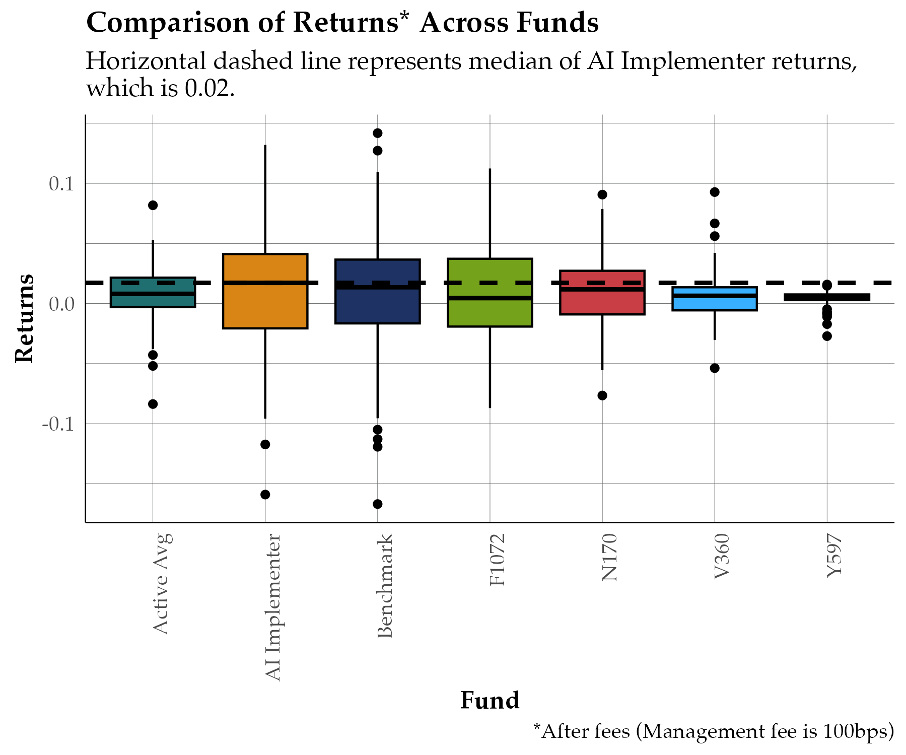
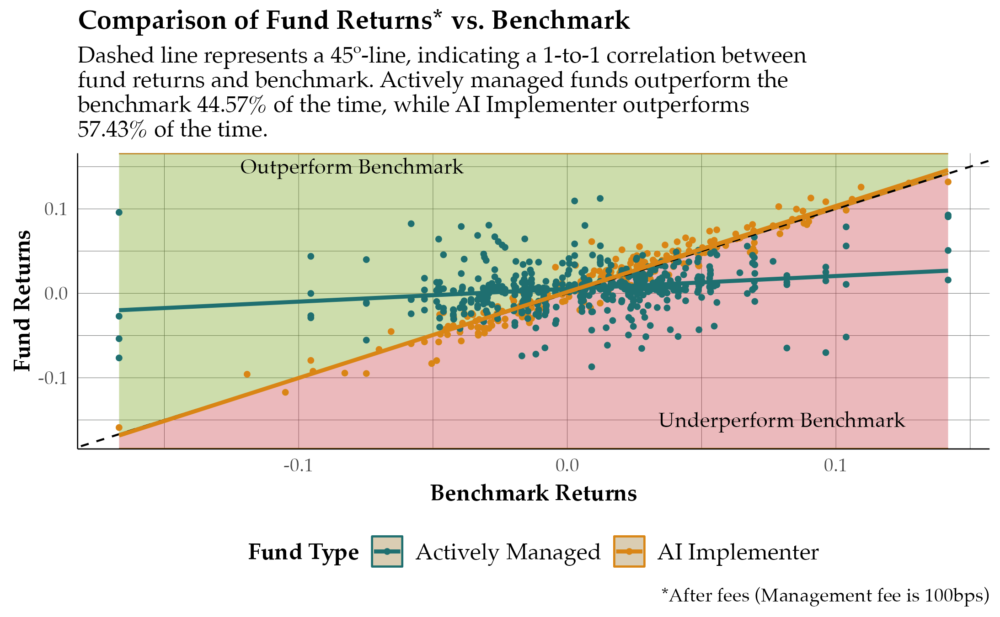
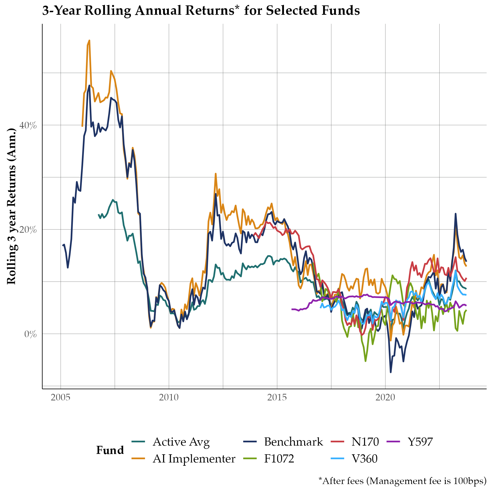

```{r setup, include=FALSE}
knitr::opts_chunk$set(echo = FALSE, message = FALSE, warning = FALSE, fig.width = 6, fig.height = 5, fig.pos="H", fig.pos = 'H')

```

## Introduction
- This presentation compares AI Implementer, a systematic Artificial Intelligence fund, with industry peers (four randomly sampled ASISA actively managed funds) and the benchmark (Capped SWIX).
- Throughout, a modest management fee of 100bps was applied to simulate net returns for actively managed funds.

## AI Implementer vs. Active Management

\footnotesize
:::::::::::::: {.columns}
::: {.column width="30%"}

- AI Implementer fund has a 2% median return, higher than peers.
- While there is higher volatility (larger IQR), it generally outperforms other funds

:::
::: {.column width="70%"}


:::
::::::::::::::

## Correlation of Fund Returns to Benchmark

\footnotesize
:::::::::::::: {.columns}
::: {.column width="30%"}
- Performance aligns closely with benchmark standards.
- Actively managed funds show varied performance, while AI Implementer demonstrates consistent returns against the benchmark.
:::
::: {.column width="70%"}


:::
::::::::::::::

## Rolling Returns over Time

\footnotesize
:::::::::::::: {.columns}
::: {.column width="30%"}
- AI Implementer consistently outperforms the benchmark.
- Some funds, including N170 and F1072, outperform the benchmark at certain intervals.
- On average, however, actively managed funds are below the benchmark.
:::
::: {.column width="70%"}


:::
::::::::::::::